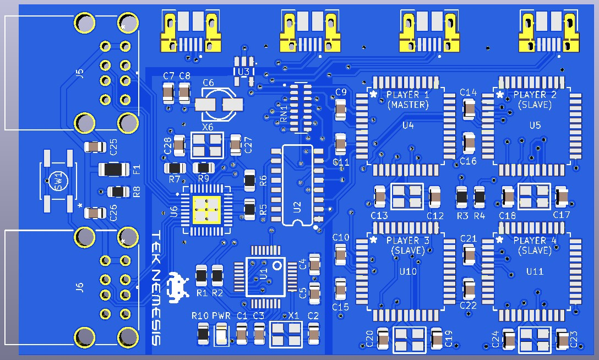
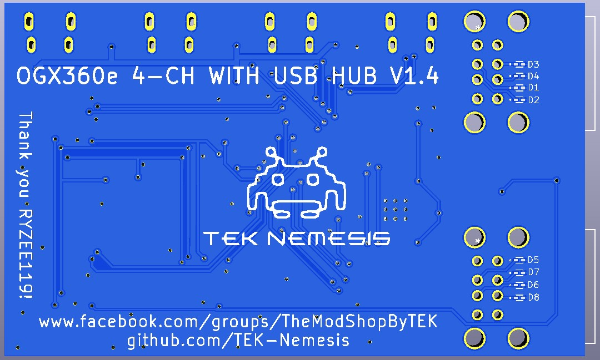

# Hardware

## Overview

 

 

### Assembly Notes

* The TVS Diodes are soldered on the bottom of the PCB.  They are optional but are highly recommended as the USB Hub Controller is highly sensitive to ESD damage.
* As the ATMEGA32U4 chips require an Arduino bootloader to operate, you can remove them from pre-assembled Arduino Pro Micro chips or manually program them with a compatible device.

