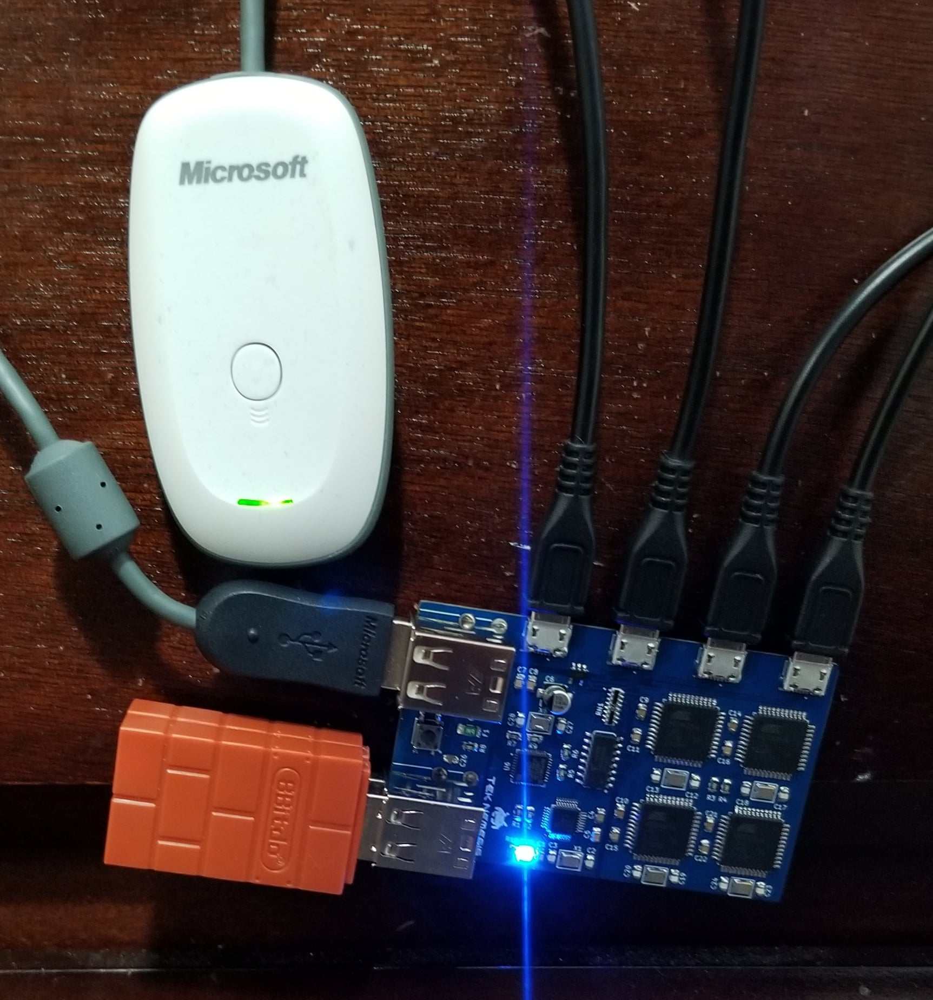

# 4-Channel OGX360 with USB Hub
External Wireless Controller mod for the Original Xbox (4 controller version with USB Hub)

## Intro
This project builds on the hard work done by Ryzee119 (Ryan Wendland) and without him, I could not have made this product for the community.  https://github.com/Ryzee119/ogx360

Please consider donating to Ryan Wendland here:
 

This variation of the OGX360 adds a 4-port USB Hub to the main PCB.  Having a built-in USB Hub allows you to plug in four different USB devices (such as a wired Hyperkin Duke controller, 8bitdo Bluetooth receiver, Xbox 360 wireless receiver, or any combination of different USB device types).

----------

### * WARNING *
This project is in the BETA STAGE.  A previous version of the PCB was tested and everything worked great but it has not gone through rigorous testing with four players bashing buttons for hours.  (LOL!)  Use at your own risk!

 
